# **PICROSSX**

## TABLE OF CONTENT 
* [Introduction](#introduction)    

* [UX and design decisions](#ux-and-design-decisions)
    * [Colors](#colors)
    * [Fonts](#fonts)
    * [Background](#background)
    * [Buttons](#buttons)
* [Wireframes and Screenshots](#wireframes-and-screenshots)
* [Features](#features)
    * [Existing features](#existing-features)
    * [Features in the future](#features-in-the-future)
* [Technologies](#technologies)
* [Testing](#testing)
    * [UX testing](#ux-testing)
    * [Validators](#validators)
    * [Chrome DevTools](#chrome-devtools)
    * [Testing game](#testing-game)
    * [Design responsiveness](#design-responsiveness)
    * [Button and link testing](#button-and-link-testing)   
* [Deployment](#deployment)
* [Credits](#credits)
    * [Content](#content)
    * [Acknowledgment](#acknowledgment)
* [Commits](#commits)

## INTRODUCTION

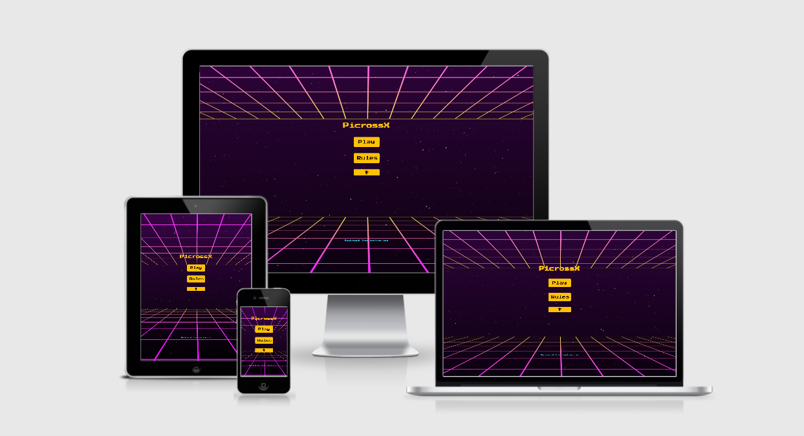
[Live game](https://ernestamajute.github.io/PicrossX/) 
[Repository](https://github.com/ErnestaMajute/PicrossX)

This project is logic puzzle game. This game was created with purpose of brain training and to use logical thinking. Designed to be easy enough for kids and more complex for adults. Game has 3 different dificulty levels to suit all player's - beginers and advanced. 80s RETRO design used to improve user experience. 

## UX AND DESIGN DECISIONS

Goal of this puzzle game is to provide entertainment. Meet player's needs by having intuitive navigation and fun design. Designed for all range devices. Created for fans of Nanograms and first time players. 
By visiting this site as a user I want:
* play a game to improve my logic thinking.  
* be able to navigate through the game with no difficulty. 
* be provided with different difficulty levels. 
* have feedback on how well I am playing so as I can track my progress.
* play puzzle game and have a good experience.

### Colors

Colors which were used set to match 80s theme of the game. 80s known as colorful time. High contrast in web - yellow, black, blue, pink, red color chosen to create retro atmoshere.

### Fonts

Font "Press Start 2P" picked exactly to remind 1980s arcade games. "Sans Serif" font added as backup font.

### Backgroud

Background image chosen theme is 80s Retro Sci-Fi. To match idea of the game, at the same time not being overwhelming, but colorful.

### Buttons

Buttons has high contrast from background image, to get atention, and to entertain by being colorful.

## WIREFRAMES AND SCREENSHOTS
* [Wireframes: desktop, tablet, mobile](assets/images/wireframes/picrossX-wireframe.png)
* [Screenshots: desktop, tablet, mobile](assets/images/screenshots)
* [Screenshots: solutions](assets/images/solutions/picross-solutions.png)

## FEATURES

### Existing features

Home page contains game header, play button which links to the levels page. Also main page has RULES button, which opens modal with simple rules. Modal has a button with link to the Wikipedia(Nanogram) page. Main page has a leaderboard modal with player's highscores. Page footer contains link to the web where from background image taken from.

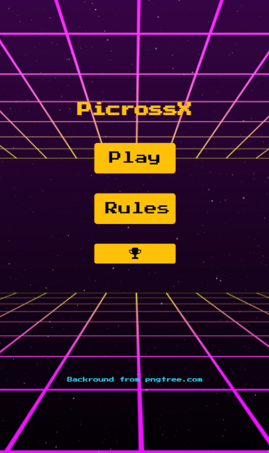

Second page contains back button which links player to the home page, also contains header, and buttons with levels. They link to other pages with tables 10x10, 15x15 or 20x20. Second page has a footer with link to the webpage where background image taken from.

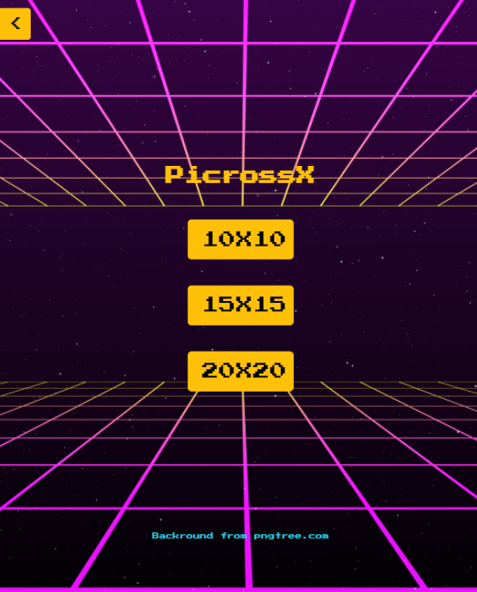

Puzzle pages contains back button, game table, restart, leaderboard and give up buttons with modals.
Back button links you to levels page.
Game table contains timer which count players time.
Game table also has score counter, to count player's score.
Table contains numbers on top and on the left. By using these numbers, player has to push the right sqares and by doing that uncover semi-abstract picture.

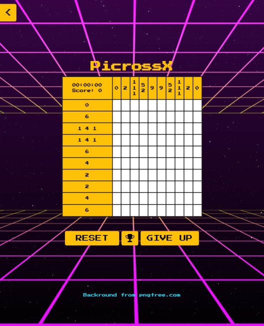
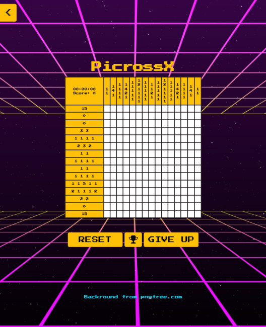
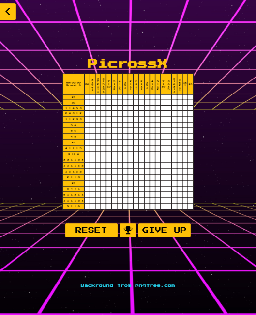

Restart button simply restarts game (reloads) current page. 

Trophy button opens leaderboard modal, which contains players name, score and time.

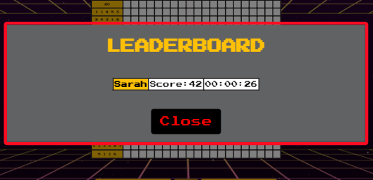

Give up button opens modal.
Give up modal shows player's score and stopped timer.

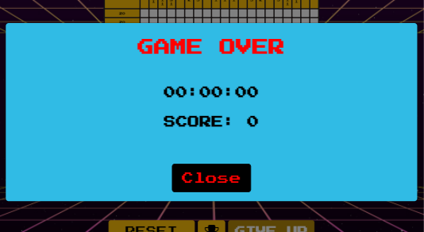

When player wins, win modal shows up. Which asks for name, and shows score and time. That data goes to the local storage. And shows up in leaderboard modal.

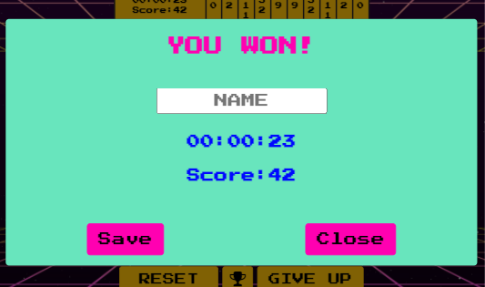

### Features in the future

1. Generate table header's numbers, to have more levels in 10x10, 15x15 and 20x20 puzzles.
2. Add sound effects, like music and and sound when button or square clicked.
3. Possibility to login for player, to continue their progress.

## TECHNOLOGIES

* HTML5
* CSS
* JAVASCRIPT(ES6)
* Gitpod
* GitHub
* Font Awesome for icons
* Google Fonts
* jQuery for DOM manipulation
* Bootstrap4 for page layout and responsive design
* W3C validator to check HTML syntax
* CSS jigsaw validator to check CSS syntax
* JSHint validator to check JAVASCRIPT syntax
* Chrome developer tools for testing the page through the development
* Microsoft Paint used to create collages from wireframes and screenshots

## TESTING

Details of testing during development.

| Test                | Stage                                            | Tool                                          |
|---------------------|:-------------------------------------------------|:----------------------------------------------|
|Syntax errors        |While developing and after completion             |W3C HTML validator, CSS validator, JSHint      |
|Debugging            |During the project                                |Chrome developer tools                         |
|Reponsive design     |During the project                                |Chrome developer tools                         |
|User game testing    |Since JavaScript code was written                 |Manual                                         |
|Browser compatibility|When project completed                            |Manual testing on different browsers           |                    
|Button testing       |While developing and after completion             |Manual                                         |
|Links testing        |While developing and after completion             |Manual                                         |

### UX testing

User goals accomplished by:

1. Goal: **play a game to improve my logic thinking.** 
Nonograms used to increase brain activity, helps get better at solving puzzles. While player has to think constantly this game increase sharpness, logical and quick thinking.
As well trains long term memory, analytical thinking and [spatial cognition](https://en.wikipedia.org/wiki/Spatial_cognition).

2. Goal: **be able to navigate through the game with no difficulty.** 
Design is user friendly. If player selects "PLAY" it link to the levels page, where player can select level difficulty, when player selects difficulty in links to the game. Buttons text has clear meanings.

3. Goal: **be provided with different difficulty levels.** 
Game provides tree different dificulty puzzles. Which can be played by kids and adults. At the momment there is just 3 puzzles, in the future that will be improved.

4. Goal: **have feedback on how well I am playing so as I can track my progress.** 
In each puzzle, on top in the left corner there is a timer and score counter, which show to players their progress. If player gives up, modal shows up with final score and time. If user wins, modal shows up with high score. After winning user can insert name and his high score will be stored, and other users will be aable to see that high score with user's name next to it.

5. Goal: **play puzzle game and have a good experience.** 
This achieved by using colors and fun design. Design makes game fun and more visually appealing. 

Goals tested by getting feedback from family members, friends who played game. Comments were made about futher improvements, and what they would like to see in this game. All that is mentioned in **Features in the future** section.

### Validators

Code syntax were checked with validators:

* [W3C validator HTML](https://validator.w3.org/)
* [CSS validator JIGSAW](https://jigsaw.w3.org/css-validator/)
* [JSHint validator](https://jshint.com/)

Errors fixed, final results bellow:

| Test                           | Expected result                | Results            |                                 
|:-------------------------------|:-------------------------------|:-------------------|
|W3C validator HTML              |No errors or warnings           |Pass                |
|CSS validator JIGSAW            |No errors or warnings           |Warnings appear     |                            
|JSHint validator                |No errors or warnings           |Warnings appear     |

JSHint results (warnings):

### Chrome DevTools

Chrome Developer Tools were used during development in:
* Layout 
* Looking for errors
* Fixing bugs
* Getting correct output (with console)  

### Testing game

At first I tested game by myself while game was still in progress. When everything was almost done, I share link to with family. Most of the bugs found by myself.

### Design responsiveness

Site tested on different device sizes by using Chrome Developer Tools.

|Screen resolutions| Devices                       |
|:---------------- |:------------------------------|
|1600x992px        |Desktop                        |
|1280x802px        |Laptop                         |
|768x1024px        |Tablet                         |
|320X568PX         |iPhone 5/SE                    |
|375x667px         |iPhone 6,7,8                   |
|414x736px         |iPhone 6,7,8 Plus              |
|375x812px         |iPhone X                       |
|360x640px         |Galaxy S5                      |
|1024x1366px       |iPad Pro                       |
|384x640px         |Nexus 4                        |
|1080x2244px       |Huawei Mate 20X(5G)            |

Final testing using [link](http://ami.responsivedesign.is/) 
Screenshot on top of README file

### Browsers

Website tested on Google Chrome, Microsoft Edge, Opera, Safari and Firefox browsers.

### Button and link testing

Results:

|Page            | Action made                           |Expected response                                         | Result  |                                 
|:---------------|----------------------------------------|:--------------------------------------------------------|:--------|
|index.html      |Click "Play" button                     |levels.html page shows up                                |Pass     |
|index.html      |Click "Rules" button                    |Rules modal shows up                                     |Pass     |                           
|index.html      |Rules modal (click "Close" button)      |Rules modal disappears                                   |Pass     |
|index.html      |Rules modal (click "Wikipedia" button)  |Opens Wikipedia Nonogram link, in new tab                |Pass     |
|index.html      |Click "Trophy icon" button              |Leaderboard with saved players highscores shows up       |Pass     |
|index.html      |Leaderboard modal (click "Close" button)|Leaderboard modal closes                                 |Pass     |
|index.html      |Click footer link                       |Opens website with images, in separate tab               |Pass     | 
|levels.html     |Click "<" button                        |Opens index.html page                                    |Pass     |                    
|levels.html     |Click "10x10" button                    |Opens 10x10.html page with puzzle                        |Pass     |  
|levels.html     |Click "15x15" button                    |Opens 15x15.html page with puzzle                        |Pass     |       
|levels.html     |Click "20x20" button                    |Opens 20x20.html page with puzzle                        |Pass     |  
|levels.html     |Click footer link                       |Opens website with images, in separate tab               |Pass     | 
|10x10.html      |Click "<" button                        |Opens levels.html page                                   |Pass     |
|10x10.html      |Click "Reset" button                    |Opens 10x10.html page                                    |Pass     |
|10x10.html      |Click "Trophy icon" button              |Leaderboard with saved players highscores shows up       |Pass     |                           
|10x10.html      |Click "Give up" button                  |Give up modal shows up                                   |Pass     |
|10x10.html      |Give up modal (click "Close" button)    |Give up modal disappears                                 |Pass     |
|10x10.html      |Click footer link                       |Opens website with images, in separate tab               |Pass     | 
|15x15.html      |Click "<" button                        |Opens levels.html page                                   |Pass     |
|15x15.html      |Click "Reset" button                    |Opens 15x15.html page                                    |Pass     |
|15x15.html      |Click "Trophy icon" button              |Leaderboard with saved players highscores shows up       |Pass     |                           
|15x15.html      |Click "Give up" button                  |Give up modal shows up                                   |Pass     |
|15x15.html      |Give up modal (click "Close" button)    |Give up modal disappears                                 |Pass     |
|15x15.html      |Click footer link                       |Opens website with images, in separate tab               |Pass     | 
|20x20.html      |Click "<" button                        |Opens levels.html page                                   |Pass     |
|20x20.html      |Click "Reset" button                    |Opens 20x20.html page                                    |Pass     |
|20x20.html      |Click "Trophy icon" button              |Leaderboard with saved players highscores shows up       |Pass     |                           
|20x20.html      |Click "Give up" button                  |Give up modal shows up                                   |Pass     |
|20x20.html      |Give up modal (click "Close" button)    |Give up modal disappears                                 |Pass     |
|20x20.html      |Click footer link                       |Opens website with images, in separate tab               |Pass     | 
|All puzzles html|Win modal (Click "Save" button)         |Saves name, score and time in local storage              |Pass     |
|All puzzles html|Win modal (Click "Close" button)        |Win modal disappears                                     |Pass     |

## DEPLOYMENT

Gitpod used as online integrated development environment then pushed to GitHub for hosting.

To deploy project on GitHub pages, steps were used:

1. Login to GitHub and select PicrossX repository.
2. Press **Settings** button, on menubar, right side.

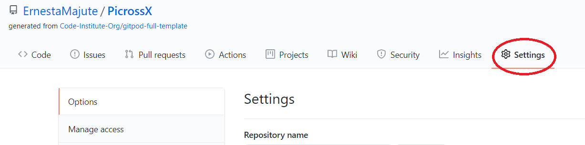

3. Scroll down, at Github pages section select Master branch and click **Save**.

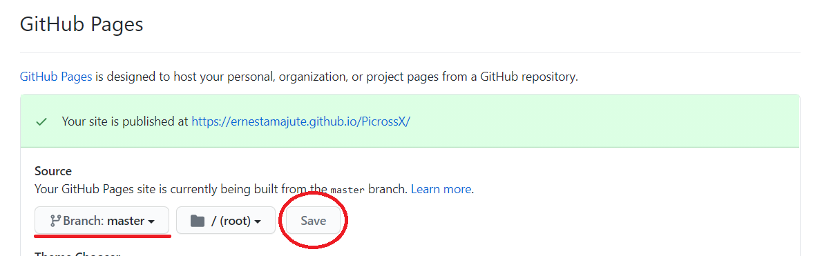

4. When completed, active link published for repository.

To run code locally, steps need to be taken:

1. On GitHub, o to the main page of repository.
2. Click Code and copy URL.

3. Open your local **IDE**
4. Open your terminal (in local IDE)
5. Change current **working directory** to the localtion where you want the cloned directory to be.
6. Type **git clone** paste copied **URL** ,press **Enter** to create local clone.

If you need more information about cloning, check GitHub Help [page](https://help.github.com/en/github/creating-cloning-and-archiving-repositories/cloning-a-repository)

## CREDITS

### Content

* [This](https://gerrycanavan.wordpress.com/2005/07/27/the-rules-of-picross/) link is source for rules.
* [Background image](https://pngtree.com/free-backgrounds)
* Timer - piece of code in picross.js file (line 50) I got from user "Yusuf" [Link](https://stackoverflow.com/questions/5517597/plain-count-up-timer-in-javascript)
* Stack Overflow used to get information and to learn while creating this project
* [Am I responsive?](http://ami.responsivedesign.is/) for screenshot and checking

### Acknowledgment

* I would like to thank my family for testing this game. Also big thanks to my mentor Reuben Ferrante who helped me a lot during this project.

## Commits
In this section I explain unclear commits:
* **Useless classes removed** to **Table headers classes removed, has no purpose** - these classes were removed almost in the end of the project, I found other ways to style headers. I decided to remove .st-r and .nd-r classes
* **Triger button added for modal** to **Button added to open give-up modal, target=_blank added to footer**
* **Changes** to **Empty line deleted**
* **h1 to h3** to **.center class added to wrapper section**
